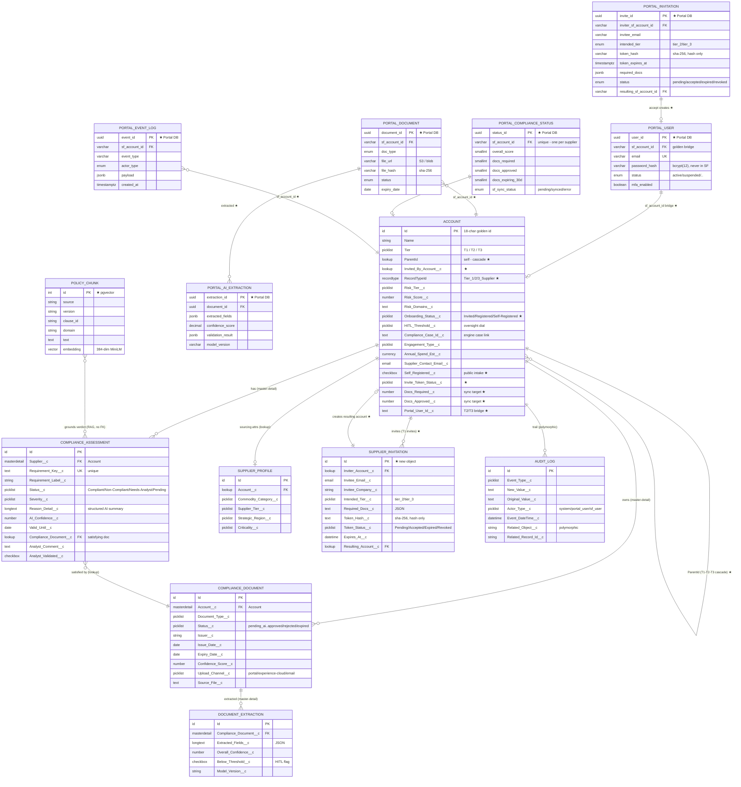
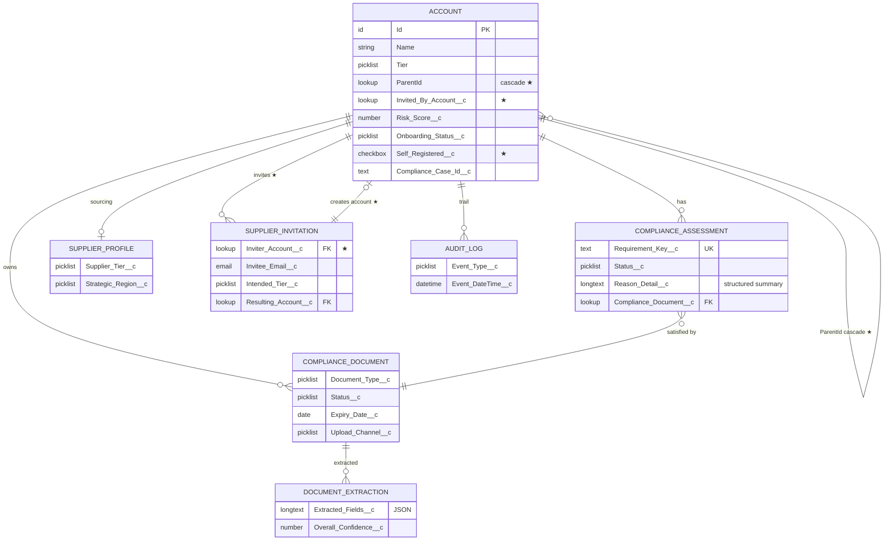

# New Data Model — ER Diagram (Mermaid)

Target data model after the architecture shift: **public self-service intake +
internal Veera app + multi-tier (T1 in Salesforce, T2/T3 via external portal)**.

> Paste either ```mermaid``` block into draw.io (Arrange → Insert → Advanced → Mermaid)
> or any Mermaid renderer.

**Legend:** `[SF]` Salesforce object · `[PORTAL]` external Postgres (T2/T3) · `[RAG]`
engine pgvector · `★` = new/changed for the shift.

---

## 1. Full ER diagram (all systems)



---

## 2. Salesforce-only view (the buyer + Tier 1 surface)

A simpler diagram if you only need the in-SF model (drop the external portal + RAG).



---

## Notes
- **`★`** marks what's new/changed for the architecture shift. Everything unmarked
  already exists in the org today.
- **`sf_account_id`** (the Account 18-char Id) is the golden cross-system FK — every
  Portal table carries it; the Portal never mints its own supplier identity.
- Master-detail vs lookup is annotated on the SF relationships (matches the verified org
  metadata). Portal relationships are FK-by-`sf_account_id`.
- `POLICY_CHUNK` has no real FK to assessments — it grounds verdicts via RAG retrieval at
  runtime; the dashed conceptual link is shown for completeness.
