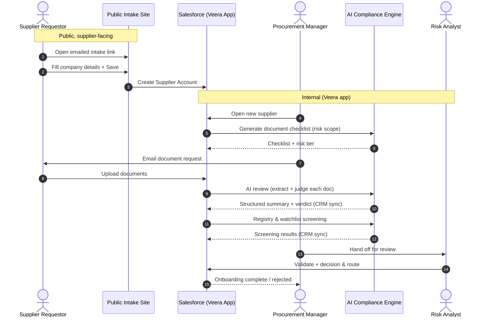
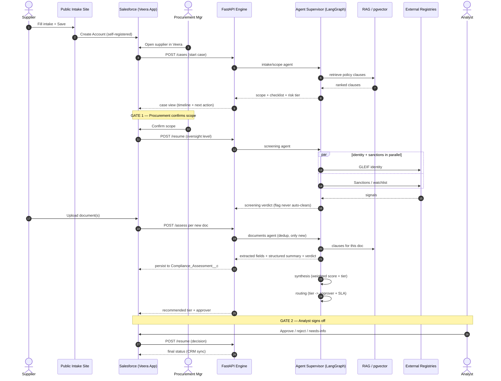

# Vendor Onboarding — End-to-End Sequence Diagrams

Two views of the same flow:
1. **High-level** — for stakeholders (intake → upload → AI review → CRM sync).
2. **Detailed** — the agentic engine steps + human gates.

> Paste either ```mermaid``` block into draw.io (Arrange → Insert → Advanced → Mermaid).

---

## 1. High-level (stakeholder view)



---

## 2. Detailed (agentic engine + human gates)



---

## Notes

- **Public vs internal boundary**: only the intake page is public/guest; every
  downstream step runs inside Salesforce (Veera app) + the engine.
- **CRM sync points**: each AI result (checklist, doc summary, screening, decision)
  is written back to Salesforce records (`Account`, `Compliance_Assessment__c`).
- **Two human gates**: Gate 1 (procurement confirms scope) and Gate 2 (analyst signs
  off); a flagged case can never auto-clear.
